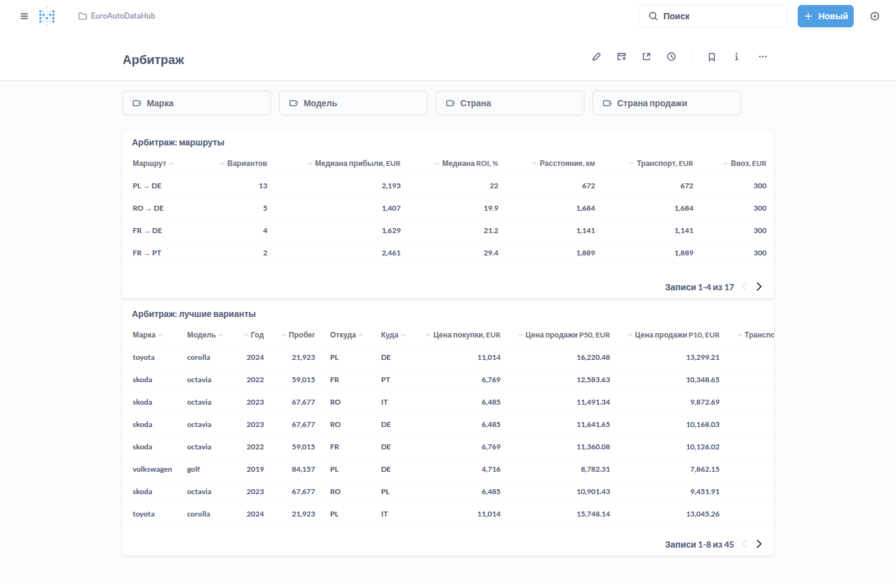
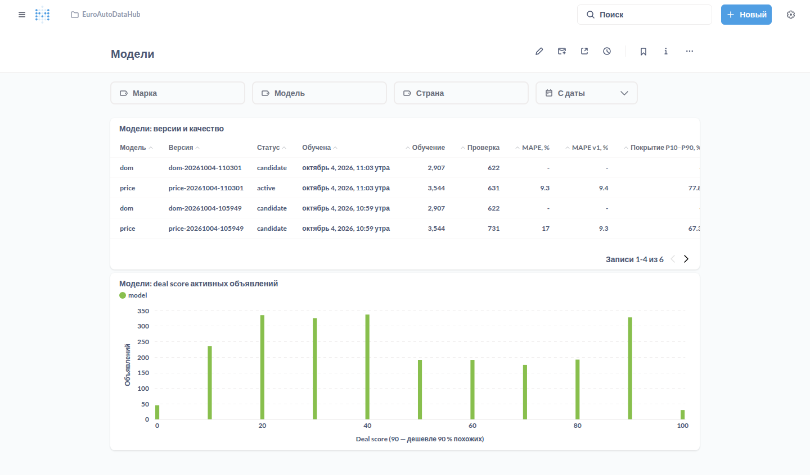

# ML: справедливая цена, deal score, арбитраж, срок до снятия

> Этап 5 [роадмапа](ROADMAP.md). Связанные документы: [PRD](PRD.md) · [Запуск на своём компьютере](LOCAL_RUN.md)
>
> Код — `services/data_processor/app/ml`. Модели обучаются в ingestor после прогона, хранятся в базе
> (таблица `ml_model`), результаты — в `listing_price_estimate`, `listing_dom_forecast`, `arbitrage_opportunity`.

## Как это работает

После каждого прогона ingestor для дня последнего запуска:

1. Переобучает модели, если пора: не чаще раза в `ML_RETRAIN_DAYS` (7 дней). Пока данных мало
   (`ML_MIN_TRAIN_ROWS`, по умолчанию 2000 объявлений), модели нет и справедливая цена считается по v1.
   Неудачная попытка повторяется не раньше чем через `ML_RETRY_HOURS` (12 ч).
2. Оценивает справедливую цену активных объявлений: моделью, а объявления редких моделей (меньше
   `ML_PRICE_MIN_SUPPORT` = 20 примеров в обучении) — по v1. Пересчитывает ценовые аномалии.
3. Прогнозирует срок до снятия и ищет варианты арбитража.

Обучение и прогнозы идут в отдельном потоке и не останавливают приём данных из Kafka. На 60 тысячах
объявлений модель цены обучается за 20–30 с на 4 ядрах.

## Модель справедливой цены (5.1)

- **Признаки.** Марка, модель, страна, площадка, топливо, КПП, привод, возраст на дату появления, пробег,
  мощность. Цель — log(цена в EUR); у снятого объявления — последняя цена.
- **Модель.** LightGBM:
  - P50 — Huber-регрессия с ограничением «цена не растёт с возрастом и пробегом»;
  - P10 и P90 — квантильная регрессия.
- **Два прохода.** Объявления, цена которых отличается от P50 первого прохода больше чем на 3,5 робастных
  отклонения, во втором проходе не участвуют. Это заниженные и завышенные цены и ошибки ввода: иначе
  модель подстраивается под них и перестаёт их замечать.
- **Интервал.** P10 и P90 калибруются конформно (CQR): на калибровочной выборке ниже P10 и выше P90
  должно оказаться по 10 % цен.
- **Проверка по времени.**
  - Объявления, появившиеся за последние `ML_VALID_DAYS` (14) дней, откладываются, модель учится на более
    ранних.
  - На отложенных считаются MAPE, медианная ошибка, покрытие интервала P10–P90 и pinball loss.
  - Рядом — v1, которая оценивает те же объявления по тем же прошлым данным.
- **Проверка качества.** Модель становится активной, только если выполнены все условия:
  - MAPE не хуже v1 (`ML_MAX_MAPE_RATIO`);
  - покрытие интервала от 70 до 90 %;
  - не хуже действующей модели больше чем на 2 % на объявлениях, которых та не видела.

  Иначе версия сохраняется со статусом `candidate` и причиной в `note`.
- **Метрики только по объявлениям, которые модель будет оценивать.** Это объявления моделей, у которых
  в обучении достаточно примеров. Новая площадка или редкая модель не бракует модель: такие объявления
  и так оценивает v1.
- **Версии.** Таблица `ml_model`: метрики, окна данных, словари признаков, сама модель. Откат:
  `python -m app.ml activate price <версия>`.

## Deal score и ценовые аномалии v2 (5.2)

По P10, P50 и P90 строится распределение цен похожих автомобилей:
- **z** — отклонение log-цены от P50 в «сигмах» интервала: вниз (P50 − P10) / 1,28, вверх (P90 − P50) / 1,28;
- **доля похожих объявлений, которые дешевле**, — Φ(z);
- **deal score** = 100 · (1 − Φ(z)): 90 — дешевле 90 % похожих (цена на уровне P10), 50 — по справедливой
  цене, 10 — дороже 90 %.

Deal score есть в карточке объявления (API и Metabase), в «ниже рынка» (фильтр `min_deal_score`) и в дайджесте.
У оценок v1 он считается по robust z.

**Аномалия по модели:** |z| ≥ `PRICE_MODEL_Z_THRESHOLD` (2,0) и отклонение от P50 не меньше 25 %. Дешевле
P50 на 60 % и больше — неправдоподобная цена (проблема качества данных), как и в v1. Порог ниже, чем
у v1 (3,0): в интервал модели входит разброс цен продавцов, поэтому её z по модулю меньше.

## Межстрановой арбитраж (5.3)

Для каждого активного объявления модель прогнозирует цену того же автомобиля в другой стране на основной
площадке этой страны. Страна продажи рассматривается, только если в обучении было не меньше
`ARBITRAGE_MIN_COMPARABLES` (20) объявлений той же модели в ней.

```
прибыль        = P50 в стране продажи − цена покупки − транспорт − ввоз
прибыль при P10 = P10 в стране продажи − цена покупки − транспорт − ввоз   (осторожная оценка)
ROI            = прибыль / (цена покупки + транспорт + ввоз)
```

Сохраняются варианты, где одновременно:
- прибыль ≥ `ARBITRAGE_MIN_PROFIT_EUR` (1000);
- ROI ≥ `ARBITRAGE_MIN_ROI` (8 %);
- прибыль при P10 не меньше нуля (`ARBITRAGE_REQUIRE_P10_PROFIT`).

Объявления с неправдоподобно низкой ценой в своей стране не рассматриваются. Результаты — дашборд
«Арбитраж», `/api/v1/arbitrage` и блок «где выгоднее продать» в карточке объявления.



### Модель издержек

Задаётся в `.env` JSON-строкой (`ARBITRAGE_COSTS`) или файлом (`ARBITRAGE_COSTS_FILE`):

```json
{
  "transport": {"eur_per_km": 1.0, "min_eur": 400, "road_factor": 1.3, "distances_km": {"DE-PL": 600}},
  "import": {
    "default": {"percent": 0.0, "fixed_eur": 300},
    "PL": {"percent": 0.031, "fixed_eur": 250, "note": "пример: акциз для двигателей до 2 л — проверьте ставку"}
  }
}
```

- **Транспорт** = max(`min_eur`, `eur_per_km` · расстояние). Расстояние берётся из `distances_km` (в обе
  стороны), иначе — между столицами по прямой × `road_factor`.
- **Ввоз** в страну продажи:
  - `percent` — доля цены покупки: акциз, налог;
  - `fixed_eur` — регистрация, техосмотр, перевод документов;
  - `per_hp_eur` — за лошадиную силу.

  Для стран без своей строки действует `default`.

Значения по умолчанию условные (транспорт 1 €/км, минимум 400 €; ввоз 300 €). Налоги и сборы зависят
от страны, объёма двигателя, выбросов и возраста автомобиля и меняются, поэтому **актуальные ставки
задаёт пользователь**.

Ограничения:
- НДС и статус продавца (дилер или частное лицо) не учитываются.
- Модели разных площадок пока не сопоставлены (`model_alias`). Если площадки называют модель по-разному
  («seria-3» на otomoto и «3er» на AutoScout24), сравнение между этими странами невозможно.

## Срок до снятия (5.4)

Снятие с публикации — не обязательно продажа.

- **Модели.** Для горизонтов `ML_DOM_HORIZONS` (7, 14, 30, 60 дней) — классификаторы LightGBM
  «объявление снимут в первые N дней».
- **Признаки** — те же, что у модели цены, плюс отклонение цены от справедливой.
- **Цензурирование.** Каждый горизонт учится только на объявлениях, которые наблюдаются не меньше N дней:
  у них исход известен, и свежие объявления не смещают оценку.
- **Начало экспозиции** — дата публикации с площадки, если она есть. Объявления, найденные в первые дни
  обхода площадки без даты публикации, в обучение не попадают: их настоящий срок неизвестен.
- **Прогноз:**
  - вероятности по горизонтам;
  - медиана срока с момента появления;
  - сколько осталось с учёта прожитого: P(T ≤ t | T > a) = (F(t) − F(a)) / (1 − F(a)).
- **Проверка качества:** ROC AUC на самом длинном обученном горизонте ≥ `ML_DOM_MIN_AUC` (0,6). Если
  в данных нет связи срока с ценой и признаками (AUC около 0,5), модель не активируется.

Модели нужно несколько недель истории: для горизонта 60 дней — объявления, которые наблюдались 60+ дней.

## Результаты

**Синтетический рынок** (`make ml-benchmark`).

Устройство рынка:
- 8–12 тысяч объявлений, 6 стран, 12 моделей;
- нелинейная амортизация; в Румынии старые машины дешевеют медленнее;
- шум цены продавца ±9 %, 3 % цен занижены на 38 %;
- дешёвые объявления снимают быстрее.

Справедливая цена на синтетике известна, поэтому ошибка измеряется и по ней. Три варианта данных:

| | Модель | v1 |
|---|---|---|
| MAPE на отложенных объявлениях (к цене объявления) | 9,4–10,3 % | 12,8–13,3 % |
| Ошибка к настоящей справедливой цене | 3,2–3,6 % | 8,3–8,6 % |
| Покрытие интервала P10–P90 (цель 80 %) | 79–83 % | — |
| «Ниже рынка»: precision / recall | 0,98 / 0,89–0,92 | 0,89–0,92 / 0,57–0,59 |
| Срок до снятия: ROC AUC (7 / 14 / 30 / 60 дней) | 0,82–0,94 / 0,75–0,78 / 0,73–0,77 / 0,72–0,76 | — |
| Арбитраж: прибыльны по настоящей цене | 100 % (20–35 вариантов) | — |

**Демо-рынок в Docker** (4 площадки, 6 стран, ~4 тыс. объявлений, `make dc-up` и `make ml-train`):
- модель цены активна: MAPE 9,2 % против 9,4 % у v1, покрытие 78 %;
- первая версия была отклонена проверкой качества, и это вскрыло две ошибки в самой проверке, обе
  исправлены. В отложенную выборку попали 100 объявлений тестовой площадки, которых модель не видела, —
  теперь метрики считаются только по объявлениям, которые модель будет оценивать. А v1 оценивала
  отложенные объявления по пулу, где были они сами, — теперь только по прошлым данным;
- модель срока до снятия не активирована (AUC ≈ 0,5): в демо-данных срок снятия случайный и с ценой
  не связан.



**На реальных данных** проверка ещё впереди: модели обучатся, когда накопится выборка (ориентир —
2–3 недели ежедневного обхода). Метрики каждой версии видны в `make ml-status`, на дашборде «Модели»
и в `/api/v1/ml/models`. Цель PRD — MAPE ≤ 12 % через 12 месяцев.

## Команды

```bash
make ml-status                  # версии моделей и метрики
make ml-train KIND=price        # обучить сейчас (проверка качества — как по расписанию)
make ml-refresh                 # пересчитать справедливые цены, прогноз срока и арбитраж
make ml-benchmark               # v1 против модели на синтетическом рынке
docker compose exec ingestor python -m app.ml activate price price-20261004-110301   # откат версии
```

## Настройки

| Переменная | По умолчанию | Смысл |
|------------|--------------|-------|
| `ML_ENABLED` | true | Выключить ML: только v1 |
| `ML_RETRAIN_DAYS` | 7 | Переобучение не чаще, дней |
| `ML_TRAIN_WINDOW_DAYS` | 365 | Обучающая выборка — объявления за столько дней |
| `ML_VALID_DAYS` | 14 | Отложенная по времени выборка |
| `ML_MIN_TRAIN_ROWS` / `ML_MIN_VALID_ROWS` | 2000 / 200 | Минимум данных для обучения и проверки |
| `ML_MAX_MAPE_RATIO` | 1.0 | MAPE модели / MAPE v1 — не больше |
| `ML_COVERAGE_MIN` / `ML_COVERAGE_MAX` | 0.7 / 0.9 | Допустимое покрытие интервала P10–P90 |
| `ML_PRICE_MIN_SUPPORT` | 20 | Примеров модели в обучении, иначе оценка по v1 |
| `PRICE_MODEL_Z_THRESHOLD` | 2.0 | Порог аномалии по модели |
| `ML_THREADS` | 0 | Потоков LightGBM; 0 — половина ядер |
| `ML_DOM_HORIZONS` / `ML_DOM_MIN_AUC` | [7,14,30,60] / 0.6 | Горизонты и порог качества модели срока |
| `ARBITRAGE_COSTS` / `ARBITRAGE_COSTS_FILE` | — | Модель издержек (JSON) |
| `ARBITRAGE_MIN_PROFIT_EUR` / `ARBITRAGE_MIN_ROI` | 1000 / 0.08 | Порог выгоды |
| `ARBITRAGE_MIN_COMPARABLES` | 20 | Объявлений модели в стране продажи |
