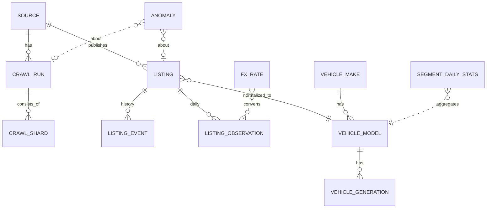
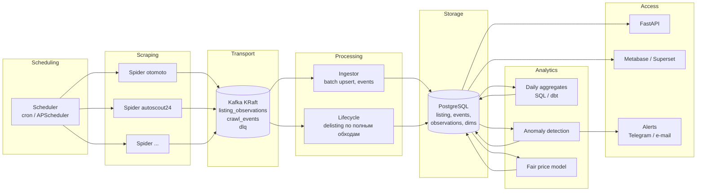

# PRD: EuroAutoDataHub

> Версия 1.0 · 2026-09-30 · Статус: черновик для согласования
> Связанные документы: [Аудит текущего состояния](AUDIT.md) · [Роадмап](ROADMAP.md)

## 1. Контекст и проблема

Рынок подержанных автомобилей в Европе фрагментирован. В каждой стране свои площадки
(otomoto.pl, mobile.de, AutoScout24, leboncoin, subito.it и др.), свои валюты, справочники
марок и моделей, свои форматы данных. Чтобы ответить на простые вопросы, приходится вручную
просматривать несколько сайтов:

- сколько на самом деле стоит конкретная модель (поколение, год, пробег) в Польше, Германии, Франции;
- растут цены или падают, растёт ли предложение;
- как быстро продаются машины сегмента;
- какие объявления подозрительно дёшевы (выгодная сделка, ошибка или мошенничество);
- где выгодно купить и куда выгодно продать (межстрановой арбитраж).

**EuroAutoDataHub** ежедневно собирает объявления с европейских площадок, приводит их к единой
модели, хранит историю каждого объявления, считает рыночную аналитику и находит аномалии.

## 2. Цели и не‑цели

### Цели (12 месяцев)

| # | Цель | Как измеряем |
|---|------|--------------|
| G1 | Ежедневный полный и корректный снимок рынка по подключённым площадкам | Полнота обхода ≥ 98 % от `totalCount` площадки; ложные снятия с публикации < 0,5 % |
| G2 | История каждого объявления: появление, изменения цены и пробега, снятие | 100 % объявлений имеют `first_seen_at`/`last_seen_at` и журнал изменений |
| G3 | Рыночная аналитика по сегментам и странам, сопоставимая в EUR | Ежедневные агрегаты готовы к 09:00 CET |
| G4 | Детекция аномалий: цены, качество данных, поведение объявлений, рыночные сдвиги, здоровье парсеров | Precision ценовых аномалий ≥ 70 % на ручной выборке; падение парсера обнаруживается в тот же день |
| G5 | Покрытие ключевых рынков ЕС | 5+ площадок в 8+ странах |

### Не‑цели

- Публичный сервис объявлений и перепубликация чужих объявлений.
- Сбор персональных данных продавцов (имена, телефоны, e‑mail).
- Обход CAPTCHA и платных защит «любой ценой». Площадка, которую нельзя собирать легально
  и стабильно, не подключается.
- Реалтайм. Целевой цикл — сутки (для отдельных сегментов возможно чаще).
- Мобильные приложения и собственный фронтенд на старте (дашборды — BI‑инструмент).

## 3. Пользователи и сценарии

| Персона | Задача | Ключевые сценарии |
|---------|--------|-------------------|
| **Аналитик рынка** (владелец продукта) | Понимать динамику рынка | Тренды цен и предложения по сегментам; сравнение стран; кривые амортизации |
| **Перекупщик / импортёр** | Находить выгодные машины и направления | Список «ниже рынка» по фильтрам; разница цен PL↔DE↔FR; скорость продажи сегмента |
| **Покупатель** | Не переплатить и не нарваться на обман | Оценка справедливой цены конкретного объявления; история цены; флаги подозрительности |
| **Оператор системы** | Поддерживать сбор в рабочем состоянии | Отчёт о ежедневном прогоне; алерты о падении объёма, блокировках, смене API площадки |

Ключевые пользовательские истории:

1. *Как аналитик*, я хочу видеть медианную цену Toyota Corolla E21 2019–2021 с пробегом 50–100 тыс. км
   в PL и DE (в EUR) по неделям за последний год.
2. *Как перекупщик*, я хочу каждое утро получать список новых объявлений на 15 %+ дешевле
   справедливой цены в выбранных сегментах.
3. *Как покупатель*, я хочу по ссылке на объявление видеть его историю цены, срок экспозиции,
   оценку справедливой цены и флаги (скрученный пробег, перевыставление, аномальная цена).
4. *Как оператор*, я хочу получить алерт, если сегодня otomoto дал на 30 % меньше объявлений, чем обычно,
   или если обход завершился неполным.

## 4. Объём (scope)

### 4.1 Источники

Приоритет определяется покрытием, стабильностью доступа и юридическими рисками.

| Волна | Площадка | Страны | Комментарий |
|-------|----------|--------|-------------|
| MVP | otomoto.pl | PL | Паук `otomoto` (GraphQL) |
| 2 | autovit.ro, standvirtual.com | RO, PT | Та же платформа OLX, что у otomoto: пауки `autovit`, `standvirtual` (проверить на живом сайте) |
| 2 | AutoScout24 | DE, IT, NL, BE, AT, FR, ES, LU | Одна площадка — много стран: паук `autoscout24` (проверить на живом сайте) |
| 3 | mobile.de | DE | Крупнейший рынок; сильная антибот‑защита — парсингом не подключается, только через партнёрский API |
| 3 | subito.it, leboncoin/lacentrale, coches.net, marktplaats, willhaben, sauto.cz | IT, FR, ES, NL, AT, CZ | По результатам юр.‑ и тех.‑оценки |

Для каждой площадки до подключения проводится **оценка**: условия использования и robots.txt,
антибот‑защита, наличие JSON/GraphQL API, объём, лимиты пагинации. Чек‑лист и оценки — в [SOURCES.md](SOURCES.md).

### 4.2 Объекты

Легковые автомобили с пробегом. Новые авто, мото и коммерческий транспорт — позже, при необходимости.

## 5. Функциональные требования

Приоритеты: **P0** — обязательно для MVP, **P1** — нужно в первой полной версии, **P2** — желательно.

### 5.1 Сбор данных (Ingestion)

| ID | Требование | Приоритет |
|----|------------|-----------|
| FR‑1 | Ежедневный автоматический запуск обхода каждой площадки по расписанию | P0 |
| FR‑2 | Обход разбит на **сегменты (шарды)**: марка, при необходимости модель или диапазон лет/цен. Для каждого шарда фиксируются ожидаемое количество (`totalCount`), собранное количество и статус (`complete`/`partial`/`failed`) | P0 |
| FR‑3 | Устойчивость к блокировкам: ограничение скорости, настоящая пауза при серии 403/429, повтор запроса, остановка обхода при устойчивой блокировке. Пул прокси: нагрузка распределяется по IP с лимитом на каждый, забаненный прокси уходит на паузу, запрос повторяется через другой | P0 |
| FR‑4 | Парсер **не зависит от БД** и других сервисов, кроме транспорта (Kafka) | P0 |
| FR‑5 | Контракт данных: единая схема сообщения `listing_observation` (версия схемы, источник, страна, ID, атрибуты, цена, валюта, время наблюдения, ID запуска) | P0 |
| FR‑6 | Возобновление прерванного обхода без повторного прохода собранных шардов | P1 |
| FR‑7 | Сохранение сырых ответов (сжатый JSON) выборочно или целиком на N дней — для переразбора и отладки | P1 |
| FR‑8 | Шаблон подключения новой площадки: базовый класс паука, маппинг в контракт, фикстуры и контрактные тесты | P1 |

### 5.2 Хранение и жизненный цикл объявления

| ID | Требование | Приоритет |
|----|------------|-----------|
| FR‑10 | Идентичность объявления — пара `(source, source_listing_id)` | P0 |
| FR‑11 | Для каждого объявления хранятся `first_seen_at`, `last_seen_at`, текущий статус (`active` / `delisted`), `delisted_at` | P0 |
| FR‑12 | Журнал изменений: цена, пробег, статус (появилось, изменилась цена, снято, вернулось) | P0 |
| FR‑13 | Объявление считается снятым, только если его нет в **N подряд полных** обходах его шарда (N по умолчанию 2). Неполные обходы не влияют на статус | P0 |
| FR‑14 | Повторно появившееся объявление возвращается в `active` с записью `relisted` в журнале | P0 |
| FR‑15 | Идемпотентная запись: повторная обработка сообщения не создаёт дублей и не искажает историю | P0 |
| FR‑16 | Ежедневные наблюдения (цена и пробег на дату) хранятся в партиционированной таблице или колоночном хранилище; срок хранения настраивается | P1 |

### 5.3 Нормализация

| ID | Требование | Приоритет |
|----|------------|-----------|
| FR‑20 | Каноничные справочники марок, моделей и поколений с маппингом значений каждой площадки | P0 |
| FR‑21 | Нормализация топлива, КПП, привода, типа кузова, цвета к единым enum | P1 |
| FR‑22 | Конвертация цен в EUR по дневному курсу ЕЦБ (таблица `fx_rate`); исходные цена и валюта сохраняются | P0 |
| FR‑23 | Нормализация брутто/нетто цены и признака «цена с НДС» (для B2B‑объявлений), если площадка это отдаёт | P2 |
| FR‑24 | Дедупликация между площадками (VIN, хэш фото, совпадение ключевых атрибутов и продавца) | P2 |

### 5.4 Аналитика

Все метрики считаются ежедневно по сегменту: страна × площадка × марка × модель × (поколение) × год × топливо × КПП
и по агрегированным уровням. Определения — в [глоссарии](#11-глоссарий-метрик).

| ID | Требование | Приоритет |
|----|------------|-----------|
| FR‑30 | Предложение: активные объявления, новые за день, снятые за день | P0 |
| FR‑31 | Цены в EUR: медиана, P25, P75, среднее без выбросов; изменение за 7/30/90 дней | P0 |
| FR‑32 | Срок экспозиции (days on market) для снятых объявлений: медиана и распределение | P1 |
| FR‑33 | Снижения цены: доля объявлений со снижением, средний размер скидки до снятия | P1 |
| FR‑34 | Кривые амортизации: цена в зависимости от возраста и пробега по модели | P1 |
| FR‑35 | Межстрановое сравнение: медианная цена сегмента по странам и разница в % | P1 |
| FR‑36 | Модель справедливой цены (fair price) для каждого активного объявления | P1 |

### 5.5 Детекция аномалий

Результат детекции — запись в таблице `anomaly`: тип, объект (объявление / сегмент / запуск),
оценка (score), объяснение (какие признаки и насколько отклонились), дата, статус (новая / подтверждена / ложная).

| ID | Класс | Примеры | Метод (v1 → v2) | Приоритет |
|----|-------|---------|-----------------|-----------|
| FR‑40 | **Здоровье сбора** | Объём дня упал на 30 %+ от медианы за 7 дней; шард неполный; всплеск 403; GraphQL‑ошибки (смена API) | Правила и пороги по `crawl_run` | P0 |
| FR‑41 | **Качество данных** | Цена 1 PLN, пробег 0 у машины 10 лет, год > текущего, мощность 5000 л.с., цена в «тысячах» | Правила и диапазоны по сегменту | P0 |
| FR‑42 | **Ценовые аномалии объявления** | Цена на 25 %+ ниже или выше справедливой | v1: robust z‑score (медиана и MAD) в сегменте с поправкой на возраст и пробег; v2: остаток ML‑модели fair price + квантильные интервалы | P1 |
| FR‑43 | **Поведенческие аномалии** | Перевыставление (снято и выставлено с новым ID); частые смены цены; скрученный пробег (тот же VIN с меньшим пробегом) | Правила по журналу изменений, сопоставление по VIN и атрибутам | P1 |
| FR‑44 | **Рыночные аномалии** | Резкое изменение медианной цены или предложения сегмента | Rolling z‑score / сезонная декомпозиция временного ряда сегмента | P1 |
| FR‑45 | **Арбитраж** | Сегмент в стране A дешевле, чем в B, больше чем на X % с учётом издержек ввоза | Сравнение медиан сегментов; настраиваемая модель издержек | P2 |

### 5.6 Доступ к данным

| ID | Требование | Приоритет |
|----|------------|-----------|
| FR‑50 | REST API: поиск объявлений, карточка с историей, статистика сегментов, аномалии | P0 |
| FR‑51 | BI‑дашборды (Metabase или Superset) поверх аналитических витрин | P0 |
| FR‑52 | Отчёт о ежедневном прогоне (объёмы, полнота, ошибки, новые аномалии) в Telegram или e‑mail | P1 |
| FR‑53 | Подписки на аномалии по фильтрам (сегмент, страна, порог скидки) | P2 |
| FR‑54 | Выгрузка данных (CSV/Parquet) по фильтру | P2 |
| FR‑55 | Аутентификация API по ключу, rate limiting | P1 |

## 6. Нефункциональные требования

| Категория | Требование |
|-----------|------------|
| Свежесть | Данные за сутки и агрегаты доступны к 09:00 CET |
| Полнота | ≥ 98 % объявлений относительно `totalCount` площадки для шардов со статусом `complete` |
| Корректность | Ложные снятия < 0,5 %; ни один неполный обход не меняет статус объявлений |
| Надёжность доставки | At‑least‑once плюс идемпотентная запись; ни одно сообщение не теряется при сбое БД (DLQ) |
| Производительность | Приём ≥ 2000 объявлений/с в БД (батчи); полный обход крупной площадки ≤ 6 ч |
| Масштаб (12 мес.) | До 5 млн активных объявлений; до 2 млрд строк наблюдений в год (партиционирование или колоночное хранилище) |
| Стоимость | MVP — один VPS (8 vCPU / 32 GB / 500 GB SSD), ≤ 100 €/мес без прокси |
| Наблюдаемость | Метрики (Prometheus), структурированные логи, отчёт о прогоне, алерты |
| Безопасность | Секреты только через env/secret store; в репозитории нет паролей; API за ключом |
| Воспроизводимость | `make up` на чистой машине поднимает стек; CI прогоняет тесты на каждый PR |
| Тестируемость | Каждый паук покрыт тестами на сохранённых фикстурах ответов; покрытие ядра ≥ 70 % |

## 7. Концептуальная модель данных

| Сущность | Назначение | Ключевые поля |
|----------|------------|---------------|
| `source` | Площадка | code (`otomoto_pl`), country, base_url, active |
| `crawl_run` | Запуск обхода площадки | id, source, started_at, finished_at, status, stats (JSON) |
| `crawl_shard` | Сегмент обхода внутри запуска | run_id, shard_key (`make=audi`), expected_count, collected_count, pages_ok, pages_failed, status |
| `listing` | Текущее состояние объявления | (source, source_listing_id), url, make/model/generation (raw и нормализованные), year, mileage, fuel, gearbox, power, price, currency, price_eur, country, region, city, seller_type, first_seen_at, last_seen_at, status, delisted_at, last_run_id |
| `listing_event` | Журнал изменений | listing, ts, type (`new`/`price_change`/`mileage_change`/`delisted`/`relisted`), old/new значения, run_id |
| `listing_observation` | Ежедневный снимок | listing, date, price, price_eur, mileage (партиции по месяцу) |
| `vehicle_make/model/generation` + `source_alias` | Каноничные справочники и маппинг значений площадок | |
| `fx_rate` | Курсы ЕЦБ | date, currency, rate_to_eur |
| `segment_daily_stats` | Витрина аналитики | date, segment keys, active, new, delisted, median/p25/p75 price_eur, median_dom |
| `anomaly` | Найденные аномалии | id, type, entity_type, entity_id, score, details (JSON), detected_at, status |

## 8. Целевая архитектура

Принципы:

1. **Корректность важнее скорости.** Статусы меняются только по полным обходам.
2. **Паук — тонкий.** Он только собирает и публикует события; вся логика жизненного цикла живёт в процессинге.
3. **Контракт данных версионирован.** Каждое сообщение несёт `schema_version`, `run_id`, `shard_key`.
4. **Идемпотентность везде.** `INSERT ... ON CONFLICT`, события с детерминированными ключами.
5. **Простая эксплуатация.** Один хост и docker compose; Kafka на одном брокере в режиме KRaft; без Redis
   и кластеров до появления реальной нагрузки.
6. **Аналитика — SQL‑first.** Витрины строятся SQL (при росте — dbt), ML подключается поверх готовых витрин.

## 9. Детекция аномалий: подход

**v1 (статистика и правила, без обучения):**

- Сегмент для сравнения: марка × модель × поколение (или год ±1) × топливо × КПП × страна.
  Если в сегменте меньше 30 объявлений, он укрупняется (убираем КПП, затем топливо, затем страну).
- Поправка на пробег и год выпуска: цена приводится к медианам сегмента через линейную регрессию
  `log(price) ~ mileage + year` внутри сегмента (МНК с повтором без выбросов).
- Оценка: `robust_z = (log(price) − median) / (1.4826 · MAD)`. Аномалия — при |z| > 3.
  Дополнительно проверяется порог отклонения в процентах, чтобы в плотных сегментах не флагались мелочи.
- Каждой аномалии пишется объяснение: «цена на 32 % ниже медианы сегмента (n=214), пробег в норме».

**v2 (ML):**

- Модель справедливой цены: градиентный бустинг (LightGBM или CatBoost) на признаках: возраст, пробег,
  мощность, объём, топливо, КПП, привод, кузов, страна, регион, тип продавца, модель и поколение.
- Квантильная регрессия (P10/P50/P90) — интервал справедливой цены. Аномалия — выход за интервал.
- Валидация по времени (обучение на прошлом, тест на будущем). Метрики: MAPE, покрытие интервалов.

**Рыночные ряды:** для каждого сегмента с достаточным объёмом — дневные ряды медианной цены и предложения.
Аномалия — отклонение от скользящей медианы за 28 дней больше чем на k·MAD (с учётом дня недели).

**Здоровье сбора:** правила по `crawl_run`/`crawl_shard` — полнота, доля ошибок, объём относительно истории.
Этот класс — самый важный на старте: сломанный парсер тихо портит все остальные метрики.

## 10. Метрики успеха

| Метрика | Цель MVP | Цель через 12 мес. |
|---------|----------|--------------------|
| Подключено площадок / стран | 1 / 1 | 5+ / 8+ |
| Полнота ежедневного обхода | ≥ 95 % | ≥ 98 % |
| Доля дней без ручного вмешательства | ≥ 80 % | ≥ 95 % |
| Ложные снятия с публикации | < 1 % | < 0,5 % |
| Precision ценовых аномалий (ручная разметка 100 шт.) | ≥ 60 % | ≥ 75 % |
| MAPE модели fair price | — | ≤ 12 % |
| Время обнаружения поломки парсера | ≤ 24 ч | ≤ 2 ч |

## 11. Глоссарий метрик

| Термин | Определение |
|--------|-------------|
| Активное объявление | Статус `active`: было в последнем полном обходе шарда или не отсутствовало N полных обходов подряд |
| Новое за день | `first_seen_at` приходится на этот день |
| Снятое за день | `delisted_at` приходится на этот день. Это **не обязательно продажа**; в интерфейсе — «снято» |
| Срок экспозиции (DOM) | `delisted_at − first_seen_at` (или `posted_at` площадки, если он надёжен) |
| Сегмент | Набор ключей: страна, площадка, марка, модель, поколение, год, топливо, КПП (уровни агрегации настраиваются) |
| Цена EUR | Цена × курс ЕЦБ на дату наблюдения |
| Полный обход шарда | Все страницы получены успешно, и собрано ≥ 98 % от `totalCount` |

## 12. Риски, допущения, соответствие требованиям

| Риск | Вероятность | Влияние | Митигирование |
|------|-------------|---------|---------------|
| Блокировки и антибот‑защита площадок | Высокая | Высокое | Консервативные лимиты, настоящие паузы, ротация User‑Agent; прокси только после юр.‑оценки; отказ от площадки, если сбор нестабилен |
| Смена API или вёрстки площадки | Высокая | Высокое | Алерты здоровья сбора, контрактные тесты, быстрый цикл исправления; при ошибках статусы не меняются |
| Лимит глубины пагинации | Средняя | Высокое | Автоматическое дробление шарда (марка → модель → годы или цены), пока `totalCount` не станет ниже лимита |
| Юридические ограничения (ToS, право sui generis на базы данных в ЕС, GDPR) | Средняя | Высокое | Не собирать персональные данные; не перепубликовывать объявления; использовать данные для внутренней аналитики и агрегатов; оценка ToS и robots.txt по каждой площадке; консультация юриста до коммерческого использования |
| Рост объёма наблюдений | Средняя | Среднее | Партиционирование по месяцам, хранение только изменений, при необходимости ClickHouse или Parquet + DuckDB |
| Разнородность справочников | Высокая | Среднее | Каноничные справочники и таблицы алиасов; очередь «неизвестных значений» на ручной маппинг |

**Допущения:** один разработчик; бюджет — один VPS; целевой цикл — сутки; первые пользователи — сам владелец и узкий круг.

## 13. Открытые вопросы

1. Целевая аудитория после MVP: внутренний инструмент, B2B‑подписка (дилеры, импортёры) или публичный сервис? От этого зависят юридические требования и приоритет API.
2. Бюджет на прокси и антибот‑сервисы (нужен для mobile.de и leboncoin)?
3. Какие страны и сегменты приоритетны для арбитража (например, PL ← DE)?
4. Нужны ли коммерческий транспорт и мото?
5. Хранить ли фото или только ссылки и перцептивные хэши (для дедупликации)?
