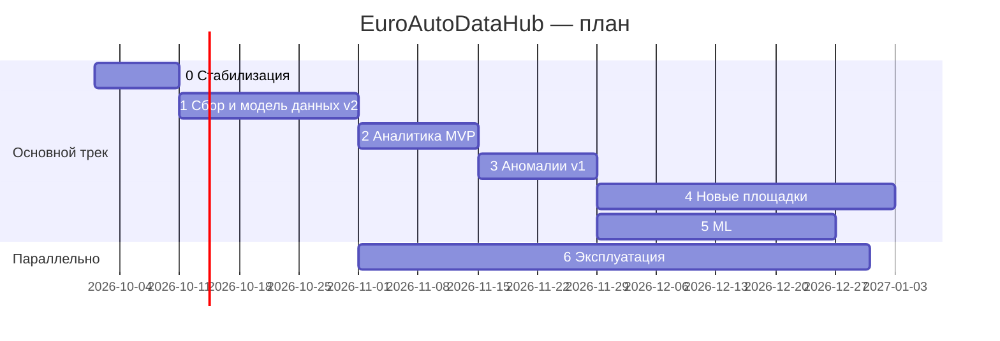
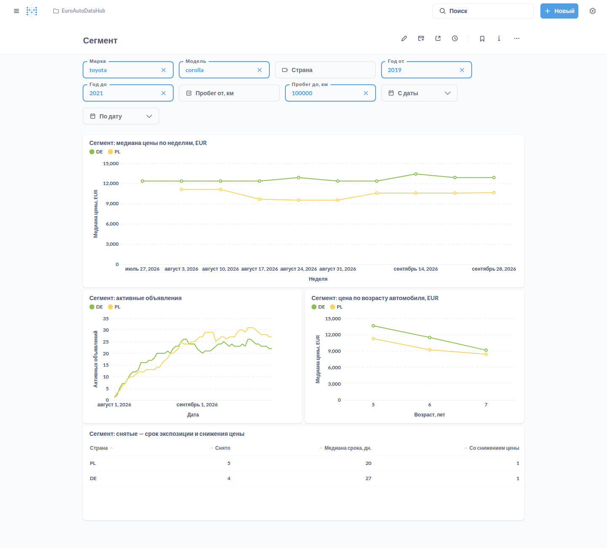
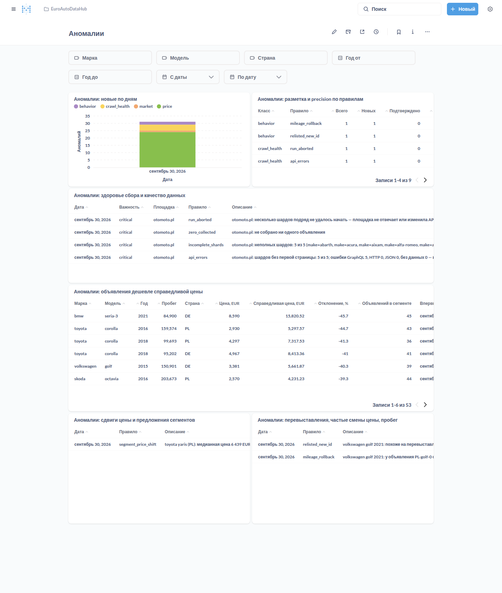

# Роадмап EuroAutoDataHub

> Версия 1.0 · 2026-09-30
> Связанные документы: [PRD](PRD.md) · [Аудит текущего состояния](AUDIT.md)

## Принцип приоритизации

**Корректность → надёжность → аналитика → аномалии → охват → ML → масштаб.**

Аудит показал, что текущий код портит данные: ложные «продажи» из‑за подстрочного сравнения марок,
неполных обходов и отсутствия «воскрешения», а сбор тихо обрывается после блокировки.
Поэтому первый этап — стабилизация, а не масштабирование.

### Что изменено относительно прежнего плана (`docs/scaling_recommendations.md`)

| Было в плане | Решение | Почему |
|--------------|---------|--------|
| Kafka‑кластер из 3 брокеров | ❌ Отложено. Один брокер в режиме KRaft (этап 1.3) | Суточный батч одного хоста не требует HA‑кластера; ZooKeeper — лишняя эксплуатация |
| `CONCURRENT_REQUESTS = 32` | ❌ Отменено | Главный риск — блокировки, а не скорость. Лимиты подбираются по метрикам 403 |
| Redis‑кэш API и Scrapy‑Redis | ❌ Отложено до этапа 6.5 | Нет нагрузки, которая это оправдывает |
| Prometheus + Grafana | ⏸ Этап 6.1 | Сначала — отчёт о прогоне и алерты здоровья сбора (этап 3.1), они полезнее на старте |
| Партиционирование БД | ✅ Этап 2.1 — для таблицы наблюдений | Нужно под историю, а не под текущий объём |
| CI/CD | ✅ Этап 0.9 — CI с тестами | Дёшево и сразу защищает от регрессий |

## Обзор этапов

| Этап | Название | Оценка | Результат (milestone) |
|------|----------|--------|-----------------------|
| 0 | Стабилизация | 1–2 нед. | **M0**: стек поднимается с нуля, обход otomoto не портит данные |
| 1 | Надёжный ежедневный сбор и модель данных v2 | 3 нед. | **M1**: корректная история объявлений по полным обходам, ежедневный автозапуск |
| 2 | Аналитика MVP | 2 нед. | **M2**: витрины сегментов, дашборды, аналитический API |
| 3 | Аномалии v1 и алерты | 2 нед. | **M3**: здоровье сбора, качество данных, ценовые и рыночные аномалии |
| 4 | Новые площадки | 1–2 нед. на площадку | **M4**: 3+ площадки, 5+ стран |
| 5 | ML и продвинутая аналитика | 3–4 нед. | **M5**: модель справедливой цены, deal score, арбитраж |
| 6 | Эксплуатация и безопасность | параллельно | Мониторинг, бэкапы, деплой, масштабирование по метрикам |

---

## Этап 0 — Стабилизация (1–2 недели)

**Цель:** система поднимается с чистого checkout. Ежедневный обход otomoto.pl не портит данные:
никаких ложных «продаж», устойчивое поведение при 403.

Статус: ✅ выполнено 2026‑09‑30, кроме живой проверки на otomoto.pl (см. DoD).

| # | Задача | Закрывает |
|---|--------|-----------|
| 0.1 ✅ | API: исправить импорт middleware (`starlette.middleware.base`), заменить `regex=` на `pattern=`, ограничить `sort_by` списком полей, добавить smoke‑тест | C1, M12 |
| 0.2 ✅ | Alembic: URL БД из переменных окружения, убрать учётные данные из `alembic.ini`, добавить `.env.example` | C2 |
| 0.3 ✅ | Scrapy: один файл настроек; Kafka, лимиты и логи — из env; удалить неиспользуемый корневой `settings.py` | H3, H6 |
| 0.4 ✅ | Список марок из `make_car.json` в пакете паука плюс аргумент `-a makes=audi,bmw`; убрать зависимость паука от БД и кода data_processor; починить `populate_car_makes.py` | C7 |
| 0.5 ✅ | Паук: настоящая пауза (`engine.pause()` / `unpause()`), повтор заблокированного запроса вместо перезапуска марки, лимит пауз с остановкой обхода; учёт полноты по марке; `ActiveIdsItem` только для полностью собранной марки (с `expected_count`); `closed()` вместо неподключённого `spider_closed`; убрать `time.sleep` и фиктивный батчинг | C4, C6, M2, M3, M4 |
| 0.6 ✅ | Пайплайн: fail‑fast при недоступной Kafka, подсчёт ошибок доставки в stats, убрать отправку всех ID из `close_spider` | H3, H4 |
| 0.7 ✅ | Status updater: точное сравнение марки; предохранитель (не снимать при пустом или неполном списке и при доле снятий выше порога); «воскрешение» объявления с записью `relisted` в истории | C3, C4, C5 |
| 0.8 ✅ | Тесты и зависимости: исправить вложенность тестов и `pytest.ini`, dev‑зависимости в `pyproject.toml`; тесты парсинга на фикстурах, 403/паузы, полноты обхода, логики снятий | H5, M11 |
| 0.9 ✅ | CI: GitHub Actions — установка зависимостей, минимальный lint (синтаксис и неопределённые имена), тесты | — |
| 0.10 ✅ | Уборка: `__initi__.py` → корректные `__init__.py`, README с быстрым стартом, пометка устаревших документов | M9, M10 |

**Definition of Done:**
- ✅ `make test` зелёный локально в окружении из `uv.lock`; API импортируется и отвечает на `/health`. CI‑workflow добавлен и запустится на pull request и push в `main`.
- ✅ Миграции применяются на чистой БД с URL из окружения (проверено на PostgreSQL 16; в Docker — `make db-upgrade`).
- ⏳ Контрольный прогон `make run-oto MAKES=rover,land-rover,suzuki,zuk` на живом сайте не снимает с публикации ни одного объявления чужой марки. Сценарий проверен на реальной БД и фейковом GraphQL‑сервере; прогон на otomoto.pl нужно выполнить на машине с доступом к сайту.

---

## Этап 1 — Надёжный ежедневный сбор и модель данных v2 (3 недели)

**Цель:** корректная история каждого объявления и ежедневный автоматический прогон с отчётом.

Статус: ✅ реализовано 2026‑09‑30. На живом otomoto.pl нужно подтвердить лимит глубины выдачи и имена фильтров
по годам (1.4). Проверка «7 дней подряд» (DoD) начнётся после развёртывания.

| # | Задача | Закрывает |
|---|--------|-----------|
| 1.1 ✅ | **Модель данных v2** в общем пакете `libs/eadh_common` (модели, схемы сообщений, настройки): `listing` с ключом `(source, source_listing_id)`, `timestamptz`, `first_seen_at`/`last_seen_at`/`status`/`delisted_at`, `listing_event`, сохранение `country_code`. Миграция данных из `auto_ad`. Убрать дублирование моделей и volume‑хаки | C8, H7, H8, M1 |
| 1.2 ✅ | **Учёт запусков и жизненный цикл**: таблицы `crawl_run` и `crawl_shard`; паук публикует события начала и конца шарда (`expected_count`, `collected_count`, `pages_failed`) в топик `crawl_events`. Снятие с публикации — только после N (по умолчанию 2) подряд полных обходов шарда без объявления. Заменяет механизм `active_car_ids` | C4, H7 |
| 1.3 ✅ | **Ingestor v2**: `aiokafka`, батчевый `INSERT ... ON CONFLICT` (500–2000 записей), коммит offset'ов после коммита БД, DLQ‑топик, graceful shutdown. Kafka — один брокер в режиме KRaft, без ZooKeeper | H1, H2, M8 |
| 1.4 ⚠️ | **Шардирование**: проверить лимит глубины пагинации otomoto; автоматически дробить шард (марка → модель → диапазон лет), если `totalCount` выше лимита. Ротация актуальных User‑Agent. Решение по robots.txt | M5, M6 |
| 1.5 ✅ | **Планировщик**: сервис `scheduler` (supercronic или APScheduler) — ежедневный запуск обходов; отчёт о прогоне (объём, полнота, ошибки) в лог и Telegram. Статус запуска берётся из `crawl_run` и stats паука (`otomoto/makes_complete` и др.), а не из кода выхода: `scrapy crawl` завершается с кодом 0 даже при недоступной Kafka | FR‑1, FR‑52 |
| 1.6 ✅ | **Нормализация v1**: каноничные справочники марок и моделей с таблицей алиасов по площадкам; курсы ЕЦБ (`fx_rate`, ежедневная загрузка) и `price_eur` | FR‑20, FR‑22 |
| 1.7 ✅ | **Сырые ответы** (опционально): gzip‑JSON на диск или в MinIO с TTL 14 дней — для переразбора и отладки | FR‑7 |

**Как реализовано:**
- 1.1: общий пакет `libs/eadh_common` (модели, контракт сообщений, настройки). Миграция `7b1e4c2d9a10` переносит данные v1, старые таблицы сохранены как `legacy_*`.
- 1.2: паук отправляет `run_started`/`shard_finished`/`run_finished`. Lifecycle определяет охват шарда по его фильтрам (марка, модель, годы) и ждёт, пока ingestor запишет все наблюдения шарда. Предохранитель `MAX_DELIST_RATIO` помечает шард `suspicious`.
- 1.3: `app.ingestor` (aiokafka). Одна транзакция на батч, offset коммитится после БД, DLQ `ingest_dlq`, ретраи при недоступной БД со сбросом пула. Kafka — cp-kafka 7.7 в режиме KRaft.
- 1.4 ⚠️: марка, у которой больше `MAX_PAGES_PER_SHARD` страниц (по умолчанию 500), делится по годам (`filter_float_year:from/to`). Нужно подтвердить на живом сайте лимит выдачи otomoto и имена фильтров. Один User‑Agent на запуск. `ROBOTSTXT_OBEY` задаётся через env; решение по площадкам — в 4.1.
- 1.5: `car_scrapers.scheduler` (ежедневно в `CRAWL_AT`, `CRAWL_TZ`). Отчёт о прогоне строит ingestor: `crawl_run.report`, лог и Telegram (если заданы `TELEGRAM_*`).
- 1.6: алиасы площадки → `vehicle_make`/`vehicle_model` (`make db-seed-makes`), курсы ЕЦБ в `fx_rate` каждые 6 ч, `price_eur` с дозаполнением.
- 1.7: gzip‑ответы в `SCRAPY_RAW_RESPONSES_DIR` с TTL (в планировщике включено, том `raw_responses`).

**Definition of Done:**
- ⏳ 7 дней подряд автоматических прогонов без ручного вмешательства — после развёртывания.
- ✅ Ни одного снятия по неполному шарду: неполные шарды получают `lifecycle_status = incomplete` и не меняют статусы. Проверено юнит‑тестами и `make e2e`.
- ⏳ Полнота ≥ 95 % по шардам — видна в отчёте о прогоне; подтвердить на живом сайте.
- ✅ Повторная обработка топика с нуля даёт то же состояние БД. Проверено полным перечитыванием топиков под новой группой потребителей: хэш состояния и число событий совпали.

---

## Этап 2 — Аналитика MVP (2 недели)

Статус: ✅ реализовано 2026‑09‑30. Дашборды проверены на локальном Metabase v0.50.36 с демо‑данными;
на реальных данных — после развёртывания.

| # | Задача |
|---|--------|
| 2.1 ✅ | Таблица `listing_observation` (партиции по месяцу) и витрина `segment_daily_stats`: активные, новые, снятые, медиана/P25/P75 цены в EUR, медианный DOM; ежедневный пересчёт SQL‑скриптами (при росте — dbt) |
| 2.2 ✅ | Metabase поверх витрин: дашборды «Рынок», «Сегмент», «Объявление», «Здоровье сбора» |
| 2.3 ✅ | API v1: сегменты и тренды, карточка объявления с историей, фильтры; цены в EUR, по умолчанию только активные; «sold» переименовано в «delisted»; ключ API. Закрывает H9, M12 (кроме rate limiting — 6.3) |
| 2.4 ✅ | Метрики второго порядка: снижения цены до снятия, кривые амортизации по модели |

**Как реализовано:**
- 2.1: ingestor пишет одну строку наблюдения на объявление за день, партиции создаёт функция `ensure_listing_observation_partition()`. Витрина считается одним SQL с `GROUPING SETS` (страна → марка → модель → модель + год) после каждого отчёта о прогоне; пересчёт за период — `make stats-backfill FROM=… TO=…`. Представления для BI: `v_listing`, `v_segment_stats`, `v_crawl_health`.
- 2.2: `bi/metabase/provision.py` через API Metabase создаёт подключение к БД, коллекцию, 14 вопросов и 4 дашборда с фильтрами; повторный запуск обновляет их. Запуск: `make bi-up`, `make bi-provision`.
- 2.3/2.4: `/api/v1/analytics/price-trend`, `/segments`, `/segments/timeseries`, `/depreciation`, `/delisted`; ключ `X-API-Key` (`API_KEYS`).
- Тесты на настоящем PostgreSQL: маркер `pg`, временная БД с миграциями; в CI — сервис postgres и `alembic check`.

**DoD:**
- ✅ Пользовательская история 1 решается дашбордом «Сегмент» (фильтры марка, модель, годы, пробег; страны — отдельными линиями) и запросом `GET /api/v1/analytics/price-trend?make=toyota&model=corolla&year_from=2019&year_to=2021&mileage_from=50000&mileage_to=100000&country=PL&country=DE`.

---

## Этап 3 — Аномалии v1 и алерты (2 недели)

Статус: ✅ реализовано 2026‑09‑30. Алерт о сломанном парсере проверен сквозным сценарием; precision
ценовых аномалий на реальных данных — после ручной разметки (см. DoD).

| # | Задача |
|---|--------|
| 3.1 ✅ | **Здоровье сбора**: правила по `crawl_run`/`crawl_shard` — падение объёма на 30 %+ от медианы за 7 дней, неполные шарды, всплеск 403, GraphQL‑ошибки (признак смены API). Алерт в Telegram. Закрывает M4 |
| 3.2 ✅ | **Качество данных**: валидаторы (цена, пробег, год, мощность, валюта); подозрительные записи помечаются и исключаются из витрин |
| 3.3 ✅ | **Ценовые аномалии**: robust z‑score (медиана и MAD) в сегменте с поправкой на пробег и укрупнением малых сегментов; таблица `anomaly` с объяснениями; ручная разметка 100 примеров для оценки precision |
| 3.4 ✅ | **Поведенческие аномалии**: перевыставление с новым ID, частые смены цены, уменьшение пробега у того же VIN |
| 3.5 ✅ | **Рыночные аномалии**: отклонение медианы цены и предложения сегмента от скользящей медианы за 28 дней |
| 3.6 ✅ | Ежедневный дайджест «ниже рынка» по сохранённым фильтрам |

**Как реализовано** (`services/data_processor/app/anomalies/`):
- Результат детекции — запись в таблице `anomaly`: класс, правило, важность, объект, оценка, объяснение, статус.
  Ключ записи — правило и объект, поэтому повторное обнаружение обновляет запись, а не дублирует. Детекторы
  не меняют ручную разметку (`confirmed` / `false_positive`). Аномалии, которые больше не подтверждаются,
  закрываются (`resolved`).
- 3.1: правила проверяются при построении отчёта о прогоне, найденные проблемы уходят в том же сообщении
  Telegram. Правила: `run_aborted`, `zero_collected`, `volume_drop`, `incomplete_shards`, `completeness_low`,
  `blocking_403`, `api_errors`, `field_fill_drop` (падение заполненности полей — признак смены формата ответа),
  `quality_share`, `lifecycle_skipped`, `proxy_bans`. Отдельно, на каждом цикле: `no_recent_run` (нет обходов
  36 ч) и `run_stuck` (обход идёт дольше 20 ч).
- Паук: у запросов появился errback. Без него упавший запрос останавливал весь обход (находка N1 в
  [аудите](AUDIT.md)). После 5 шардов подряд без первой страницы обход останавливается с причиной
  `shard_failures`.
- 3.2: флаги `listing.quality_flags` ставятся при приёме наблюдения и пересчитываются после прогона.
  Цены помеченных объявлений не учитываются в витрине, аналитическом API, дашбордах и справедливой цене.
- 3.3: справедливая цена v1 (`listing_price_estimate`) для каждого активного объявления. Сравнение идёт
  в сегменте «модель, год ±1, страна, топливо, КПП» с укрупнением до «все страны». Поправка на пробег и год
  выпуска — через МНК с повтором без выбросов. Правила:
  - `price_below_market` / `price_above_market` — |z| ≥ 3 и отклонение ≥ 25 %;
  - `price_implausible` — скидка ≥ 60 %, это проблема качества данных, а не выгодное предложение.

  Разметка: `python -m app.anomalies sample|labels|precision` или `PATCH /api/v1/anomalies/{id}`.
- 3.4: `relisted_new_id` (VIN или продавец + модель + год + пробег ±3 %), `frequent_price_changes`
  (4+ за 14 дней), `mileage_rollback` (уменьшение пробега объявления или у нового объявления с тем же VIN).
- 3.5: `segment_price_shift`, `segment_supply_shift` — отклонение от скользящей медианы на 3.5·MAD и минимум
  7 % для цены или 15 % для предложения. Медиана дня не сравнивается, если наблюдений меньше половины
  активных объявлений.
- 3.6: подписки `alert_subscription` (`/api/v1/subscriptions`), дайджест раз в сутки после прогона:
  объявления, которые появились или подешевели и стоят дешевле справедливой цены на `min_discount` и больше.
  После прогона также уходит сводка новых аномалий.
- Доступ: `/api/v1/anomalies` (список, сводка с precision, `below-market`, разметка). В карточке объявления
  показываются справедливая цена, флаги качества и открытые аномалии. В Metabase — дашборд «Аномалии».

**DoD:**
- ✅ Искусственно сломанный парсер (неверный хэш запроса) вызывает критический алерт в отчёте того же прогона:
  `make e2e`, день 6. День 7 — HTTP 400 и остановка обхода.
- ⚠️ Precision ценовых аномалий ≥ 60 % — нужна ручная разметка 100 примеров на реальных данных. На
  синтетическом рынке (8 вариантов данных, 3 % цен занижены на 40 %) у правила `price_below_market`
  precision 0.83–1.00, recall 0.83–0.97.

---

## Этап 4 — Новые площадки (1–2 недели на площадку)

Статус: ✅ реализовано 2026‑09‑30 на фикстурах и фейковых сайтах. Живая проверка площадок не выполнена
(сеть окружения разработки закрыта для сайтов): перед включением в обход — `make probe`
([SOURCES.md](SOURCES.md#проверка-на-живом-сайте)).

| # | Задача |
|---|--------|
| 4.1 ✅ | Чек‑лист оценки площадки: ToS, robots.txt, антибот‑защита, наличие JSON/GraphQL API, объём, лимиты пагинации, юридические риски. Закрывает M6 |
| 4.2 ✅ | Базовый класс паука (шарды, пауза, полнота, события запуска) и контрактные тесты на фикстурах |
| 4.3 ✅ | autovit.ro и standvirtual.com — проверить общность платформы с otomoto и переиспользовать паука |
| 4.4 ✅ | AutoScout24 — один паук на несколько стран |
| 4.5 ✅ | mobile.de — по итогам оценки (антибот, бюджет на прокси): парсингом не подключается, только через партнёрский API |
| 4.6 ✅ | Межплощадочная дедупликация (VIN, атрибуты; перцептивный хэш фото — позже) |
| 4.7 ✅ | **Пул прокси** (сделан раньше, 2026‑09‑30): запросы распределяются по IP. У каждого прокси свои лимиты нагрузки (`CONCURRENT_REQUESTS_PER_DOMAIN`, `DOWNLOAD_DELAY`, AutoThrottle). При 403/429 или ошибке соединения запрос повторяется через другой прокси, а сам прокси уходит на паузу с экспоненциальным ростом. У каждого прокси свой User‑Agent. Статистика попадает в отчёт о прогоне, при банах уходит алерт `proxy_bans` |

**Как реализовано** (подробности и оценки площадок — в [SOURCES.md](SOURCES.md)):
- 4.2: `spiders/base.py` — `ShardedSpider`. Общая механика вынесена из паука otomoto без изменения поведения:
  шарды, дробление, полнота, 403 и паузы, errback, остановка при смене API, сырые ответы, итоги запуска.
  Площадка реализует хуки `page_url`, `extract_page`, `build_item`, при необходимости `split_shard`
  и `item_matches_shard`. Контракт шарда расширен фильтрами `country`, `price_from`, `price_to`.
- 4.3: `autovit`, `standvirtual` — наследники паука otomoto с другим адресом и страной. Хэш persisted query
  задаётся настройкой (`SCRAPY_<ПАУК>_QUERY_HASH`) без изменения кода.
- 4.4: `autoscout24` — `__NEXT_DATA__`, лимит 20 страниц. Шард «страна + марка» дробится по годам, затем
  по ценовым полосам. Если объявления на странице не подходят под шард, фильтр площадкой не применён,
  и шард неполный. Lifecycle понимает страну и цену. Шард с ценой применяется, только если запуск завершён
  штатно и соседние шарды той же страны и марки полные.
- 4.6: `app/dedup.py`, таблица `listing_duplicate`. Дубли ищутся по VIN и однозначному совпадению атрибутов
  на разных площадках. Дубль не входит в витрину, аналитику, справедливую цену и дайджест. В карточке
  объявления видны остальные объявления того же автомобиля.
- Проверка паука на живом сайте без Kafka: `make probe SPIDER=… MAKES=…` (`OUTPUT_FILE` и отчёт
  `car_scrapers/probe.py`). Запуск любого паука в Docker: `make run-spider`.

**DoD:**
- ✅ `make e2e`, дни 9–10: обход AutoScout24 с двумя странами на фейковом сайте. Шард дробится по годам
  и ценовым полосам, все 33 шарда полные. Пропавшие объявления в годовом и ценовом шардах получают
  первый пропуск, остальные не затронуты.
- ⚠️ M4 (3+ площадки, 5+ стран): пауки готовы для 4 площадок и 11 стран. Включение в ежедневный обход —
  после `make probe` на живых сайтах и юридической проверки из SOURCES.md.
- Следующий шаг: сопоставление моделей между площадками (`model_alias`) для сравнения стран и дублей
  по атрибутам.

---

## Этап 5 — ML и продвинутая аналитика (3–4 недели)

| # | Задача |
|---|--------|
| 5.1 | Модель справедливой цены: LightGBM или CatBoost, квантили P10/P50/P90, валидация по времени, еженедельное переобучение, версионирование моделей |
| 5.2 | Deal score и ценовые аномалии v2 на основе интервалов модели |
| 5.3 | Межстрановой арбитраж с настраиваемой моделью издержек (транспорт, акциз, регистрация) |
| 5.4 | Прогноз срока продажи объявления |

---

## Этап 6 — Эксплуатация и безопасность (параллельно, начиная с этапа 1)

| # | Задача |
|---|--------|
| 6.1 | Метрики Prometheus в сервисах (`/metrics`), Grafana. Привести `docker-compose.monitoring.yml` в рабочее состояние или удалить; убрать пароли из compose. Закрывает M7 |
| 6.2 | Бэкапы PostgreSQL (ежедневный `pg_dump` или WAL‑G) и регулярная проверка восстановления |
| 6.3 | Секреты только через env/secret store, CORS из настроек, rate limiting API. Закрывает M12 |
| 6.4 | Деплой на VPS: prod‑профиль compose, автоматический рестарт, обновление по тегу |
| 6.5 | Масштабирование — только по метрикам: ClickHouse или Parquet + DuckDB для наблюдений, несколько воркеров Scrapy, Redis — если появится реальная потребность |

---

## Журнал выполнения

| Дата | Этап | Что сделано |
|------|------|-------------|
| 2026-09-30 | — | Аудит, PRD, роадмап |
| 2026-09-30 | 0 | API: исправлен импорт middleware, добавлены `pydantic-settings` и команда запуска в Dockerfile, белый список `sort_by`, `lifespan` вместо `on_event` |
| 2026-09-30 | 0 | Alembic берёт URL из `POSTGRES_*`/`SYNC_DATABASE_URL`, учётные данные удалены из `alembic.ini`; добавлен `.env.example` |
| 2026-09-30 | 0 | Паук: список марок из справочника в пакете (`-a makes=...`), без зависимости от БД; настоящая пауза движка при серии 403 и повтор запроса; остановка после `MAX_PAUSES`; учёт полноты по марке; `ActiveIdsItem` только для полной марки (`complete`, `expected_count`); итоговые stats `otomoto/*` |
| 2026-09-30 | 0 | Пайплайн: fail‑fast без Kafka, счётчики доставки, удалена отправка всех ID в `close_spider`; настройки Kafka и лимитов — из env |
| 2026-09-30 | 0 | Status updater: точное сравнение марки, предохранители (неполный обход, пустой список, доля снятий > `MAX_DELIST_RATIO`); повторно появившиеся объявления возвращаются в продажу с записью `relisted` |
| 2026-09-30 | 0 | Тесты: 93 теста (паук 78, data_processor 10, API 5), включая сценарий rover/land‑rover; единые зависимости в `pyproject.toml` + `uv.lock`; CI в GitHub Actions; README; удалены `__initi__.py` и неиспользуемый корневой `settings.py` |
| 2026-09-30 | 1.1 | Пакет `eadh_common`, модель данных v2 (`listing`, `listing_event`, `crawl_run`, `crawl_shard`, справочники, `fx_rate`), миграция с переносом данных v1 в `legacy_*` |
| 2026-09-30 | 1.2, 1.3 | Ingestor v2 вместо consumer/status_consumer: батчи, идемпотентная запись, события объявлений, DLQ, ретраи; lifecycle по полным шардам; отчёт о прогоне |
| 2026-09-30 | 1.2, 1.4, 1.7 | Паук v2: `run_id`, события обхода, дробление марки по годам, User‑Agent на запуск, сырые ответы; контрактные тесты по схемам ingestor |
| 2026-09-30 | 1.5, 1.6 | Планировщик ежедневных обходов; справочник марок и курсы ЕЦБ, `price_eur` |
| 2026-09-30 | — | API на модели v2: активные объявления по умолчанию, цены в EUR, журнал изменений, срок экспозиции |
| 2026-09-30 | 1.3 | docker-compose: Kafka KRaft, `kafka_init`, `ingestor`, `scheduler`; `make e2e` — сквозной сценарий из 4 «дней» |
| 2026-09-30 | — | Найдено сквозными проверками и исправлено: ingestor падал при отключении PostgreSQL (ошибки asyncpg не считались временными); повтор последнего наблюдения «возвращал» снятое объявление. Тестов: 167 (пакет 15, паук 95, ingestor 43, API 14) + e2e |
| 2026-09-30 | — | PR #1 (этапы 0–1) влит в `main` |
| 2026-09-30 | 2.1 | `listing_observation` с партициями по месяцам, витрина `segment_daily_stats`, представления для BI; тесты на PostgreSQL в CI |
| 2026-09-30 | 2.3, 2.4 | Аналитический API: тренд цены, сегменты, амортизация, снятые; ключ API |
| 2026-09-30 | 2.2 | Metabase как код: 4 дашборда, 14 вопросов; проверено на Metabase v0.50.36 |
| 2026-09-30 | — | `make e2e` проверяет наблюдения и витрину. Тестов: 204 (пакет 16, паук 95, ingestor 49, API 25, дашборды 19) + e2e |
| 2026-09-30 | — | PR #2 (этап 2) влит в `main` |
| 2026-09-30 | 3.0 | Паук: errback для упавших запросов (раньше один такой запрос обрывал весь обход), остановка после серии шардов без первой страницы, счётчики заполненности полей. JSON‑колонки хранят `None` как SQL `NULL` |
| 2026-09-30 | 3.1, 3.2 | Правила здоровья сбора в отчёте о прогоне, алерты «нет обходов» и «обход завис»; флаги качества данных, исключение из витрин и аналитики |
| 2026-09-30 | 3.3–3.6 | Справедливая цена v1 и ценовые аномалии, поведенческие и рыночные аномалии, подписки и дайджест «ниже рынка», сводка новых аномалий; API аномалий и подписок, дашборд «Аномалии» |
| 2026-09-30 | 4.7 | Пул прокси с лимитом нагрузки на IP, повтором через другой прокси при бане и паузой забаненного |
| 2026-09-30 | — | `make e2e`: 8 «дней» — перевыставление по VIN, цена‑заглушка, неверный хэш запроса, HTTP 400, обход через три прокси с одним забаненным. Тестов: 285 (пакет 16, паук 121, ingestor 89, API 33, дашборды 26) + e2e |
| 2026-09-30 | 4.1, 4.5 | Оценка площадок и чек‑лист (`docs/SOURCES.md`); mobile.de — только через партнёрский API |
| 2026-09-30 | 4.2–4.4 | Базовый класс паука `ShardedSpider`; пауки autovit.ro, standvirtual.com, AutoScout24 (8 стран); шарды со страной и ценой в lifecycle; `make probe` |
| 2026-09-30 | 4.6 | Дубли объявлений между площадками (`listing_duplicate`) исключаются из витрины, аналитики и справедливой цены |
| 2026-09-30 | — | `make e2e`: 10 «дней», дни 9–10 — AutoScout24 с дроблением по годам и цене. Тестов: 317 (пакет 16, паук 143, ingestor 98, API 34, дашборды 26) + e2e |
| 2026-10-04 | — | Запуск в Docker с нуля проверен: сборка, `make dc-up`, `make e2e` на стеке, `make run-oto`, Metabase. `make db-seed-makes` не читал `.env` и падал — теперь он и `make bi-provision` запускаются в контейнере, на хосте нужны только Docker, git и make |
| 2026-10-04 | — | Инструкция по запуску на своём компьютере (`docs/LOCAL_RUN.md`): установка на Windows (WSL 2), macOS и Linux, uv с окружением в `.venv` проекта, первый обход, дашборды, проверка площадок |
